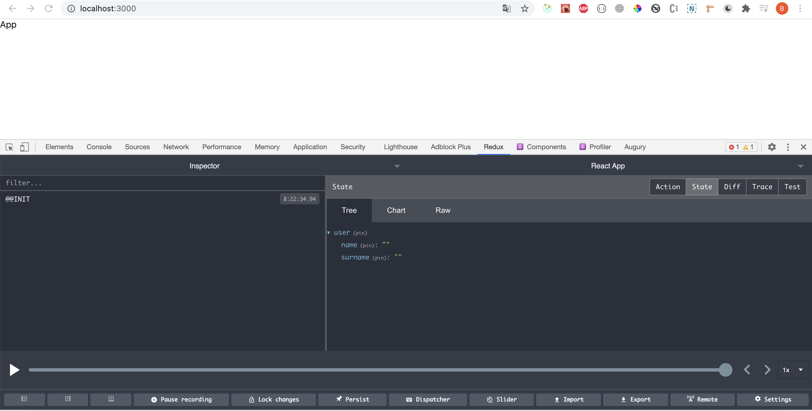

## Практическая работа 0: Тестовый проект на React

## Начало работы

Задача:

В рамках данной практической работы необходимо создать ToDo приложение. Основня задача состоит в том, чтобы в приложении было 3 страницы - ProtectedPage, NotProtectedPage, UnauthorizedPage (последняя для того, чтобы информировать пользователя о том, что он не может получить доступ к защищенной странице будучи не залоггиненым). Так же должна быть возможность залоггинеться и разлоггинеться (для этой цели необходимо использовать localeStorage, хранить значение isAuthorized). На странице NotProtectedPage должен отображаться список всех ToDo, которые добавил пользователь, без возможности изменять этот список. На странице ProtectedPage должен отображаться список добавленных ToDo, кроме того, должна быть возможность добавлять новые ToDo и удалять имеющиеся). Список ToDo хранить в Redux. Если пользователь пытается перейти на защищенную страницу, перенаправлять его на страницу UnauthorizedPage.

Ниже представлено описание базовой конфигурации проекта. Некоторые части можно переиспользовать. Ссылка на базовый шаблон: https://github.com/SatanovsyiVitalii/practice-0-app. Большая часть функциональных частей уже реализована, единственное, решается немного другая задача. Необходимо разобраться как работает базовый шаблон, и на его базе решить задачу с ToDo. Удачи :)

Используемые технологии:

1. React (create-react-app)
2. CSS
3. axios
4. browser locale storage
5. react-router

Ниже представлено приложение в котором имеется три страницы - ```/```, ```/protected```, ```/unauthorized```. На странице ```/``` отображается ```имя``` и ```фамилия``` пользователя без возможности редактировать эти значения. На странице ```/protected``` предоставляется возможность редактировать значения ```имя``` и ```фамилия```, однако эта страница доступна только при условии, если пользователь залоггинен (для эмуляции процесса логгинизации используется ```localeStorage``` браузера). Об ```localeStorage``` можно почитать здесь https://developer.mozilla.org/ru/docs/Web/API/Window/localStorage. Коротко ```localeStorage``` - это хранилище, которое предоставляет браузер, в нем мы и будем хранить значение, залоггинен пользователь или нет. Если пользователь пытается попасть на страницу ```/protected```, его перенаправляет на ```/unauthorized```.
## Создание базового приложения с помощью create-react-app

Для того чтобы создать приложение на react:

`npx create-react-app practice-0`\
`cd practice-0`\
`npm start`

Чтобы писать код используя React, необходимо знать некоторые базовые концепции из мира React:

1. [Привет, мир](https://ru.reactjs.org/docs/hello-world.html)
2. [Знакомство с JSX](https://ru.reactjs.org/docs/introducing-jsx.html)
3. [Рендеринг элементов](https://ru.reactjs.org/docs/rendering-elements.html)
4. [Компоненты и пропсы](https://ru.reactjs.org/docs/components-and-props.html)
5. [Обработка событий](https://ru.reactjs.org/docs/handling-events.html)
6. [Условный рендеринг](https://ru.reactjs.org/docs/conditional-rendering.html)
7. [Списки и ключи](https://ru.reactjs.org/docs/lists-and-keys.html)
8. [Формы](https://ru.reactjs.org/docs/forms.html)
9. [Подъём состояния](https://ru.reactjs.org/docs/lifting-state-up.html)
10. [Использование хука состояния](https://ru.reactjs.org/docs/hooks-state.html)
11. [Использование хука эффекта](https://ru.reactjs.org/docs/hooks-effect.html)

## Подключение react-router

1. Необходимо установить react-router

```npm install react-router-dom```

2. Подключить react-router к нашему react приложению

В файле src/App.js импортировать необходимые элементы из react-router

```
import {
  BrowserRouter as Router,
  Switch,
  Route,
  Link
} from "react-router-dom";
```

Более подробную информацию об каждом элементе можно найти по ссылке https://reactrouter.com/web/api/BrowserRouter

Добавить элементы в jsx

```
function App({ user }) {
  return (
    <Router>
      <div className="App">
        <nav>
          <ul>
            <li>
              <Link to="/">NotProtectedUserPage</Link>
            </li>
            <li>
              <Link to="/protected">ProtectedUserPage</Link>
            </li>
          </ul>
        </nav>

        <Switch>
          <Route path="/protected">
            <ProtectedUserPage />
          </Route>
          <Route path="/">
            <NotProtectedUserPage />
          </Route>
        </Switch>
      </div>
    </Router>
  );
}
```

3. Создать папку под компоненты, назвать ее ```components```. В папке ```components``` создать два компонента - ```ProtectedUserPage```, ```NotProtectedUserPage```

ProtectedUserPage.js

```
export default function ProtectedUserPage() {
  return <div>
    ProtectedUserPage
  </div>
}
```

NotProtectedUserPage.js

```
export default function NotProtectedUserPage() {
  return <div>
    NotProtectedUserPage
  </div>
}
```

ProtectedUserPage будет доступен в браузере по пути ```http://localhost:3000/protected```, NotProtectedUserPage - ```http://localhost:3000/```

4. Создание защищенного route

В папке ```components``` создать файл ```ProtectedRoute``` со следущим содержимым:

```
import React from 'react';
import { Route, Redirect } from 'react-router-dom';

const ProtectedRoute = ({ component: Component, ...rest }) => {
  const isAuthorized = localStorage.getItem("isAuthorized") === "true";
  return (
    <Route {...rest} render={
      props => {
        if (isAuthorized) {
          return <Component {...rest} {...props} />
        } else {
          return <Redirect to={
            {
              pathname: "/unauthorized",
            }
          } />
        }
      }
    } />
  )
}

export default ProtectedRoute;

```

Как вы могди заметить, данный роут работает следующим образом: если в localStorage значение ```"isAuthorized"``` равно ```"true"```, то рендерим компонент, который передаем в ```ProtectedRoute```. В случае, если ```"isAuthorized"``` равно ```"false"```, то перенаправляем пользователя по пути ```/unauthorized```. Для пути ```/unauthorized``` создадим компонент в следущей секции.

5. Создание компонента для ```/unauthorized``` пути

Создадим файл ```NotAuthorized.js``` в папке ```components```

```
export default function NotAuthorized() {
  return (
    <div>
      403
    </div>
  )
}
```

У нас есть все необходимое, чтобы обновить наш App.js файл

6. Добавление кнопок LogIn и LogOut

Добавим кнопки LogIn и LogOut в наш NavBar

Создадим под это отдельный компонент с названием ```NavBar``` и поместим его в папку ```components```. Вынесем в него ```nav``` элемент из App.js, и добавим кнопки LogIn и LogOut. Так же обернем компонент NavBar в HOC, который называется ```withRouter```. Делается это для того, чтобы получить доступ к history, с помощью, которой, в свою очередь, мы болучаем возможность перенаправлять пользователя с помощью метода ```push```. Окончательный результат компонента ```NavBar```:

NavBar.js

```
import {
  Link,
} from "react-router-dom";
import { withRouter } from "react-router";

function NavBar({ history }) {
  return (
    <nav>
      <Link to="/">NotProtectedUserPage</Link>
      <Link to="/protected">ProtectedUserPage</Link>
      <button onClick={() => {
        localStorage.setItem("isAuthorized", true);
        history.push("/protected");
      }}>LogIn</button>
      <button onClick={() => {
        localStorage.setItem("isAuthorized", false);
        history.push("/");
      }}>LogOut</button>
    </nav>
  )
}

export default withRouter(NavBar);
```

Кнопка LogIn позволяет "залоггинить" ползователя. Изменяется занчение ```"isAuthorized"``` на "true". Важно отметить, что несмотря на то, что мы устанавливаем значение в true, в localeStorage оно хранится как "true" (как строка). ```LogOut``` меняет значение ```"isAuthorized"``` на ```"false"```.

7. Добавление защищенного route и компонентов ```NotAuthorized``` и ```NavBar``` в компонент ```App```. Обновленная верси ```App.js```:

```
import {
  BrowserRouter as Router,
  Switch,
  Route,
} from "react-router-dom";
import { withRouter } from "react-router";

import ProtectedRoute from "./components/ProtectedRoute";
import NotProtectedUserPage from "./components/NotProtectedUserPage";
import ProtectedUserPage from "./components/ProtectedUserPage";
import NotAuthorized from "./components/NotAuthorized";
import './App.css';
import NavBar from "./components/NavBar";

function App({ history }) {
  return (
    <Router>
      <div className="App">
        <NavBar />
        <Switch>
          <ProtectedRoute path='/protected' component={ProtectedUserPage} />
          <Route path="/unauthorized">
            <NotAuthorized />
          </Route>
          <Route path="/">
            <NotProtectedUserPage />
          </Route>
        </Switch>
      </div>
    </Router>
  );
}

export default App;
```
## Подключение Redux

Основная идея Redux предоставить глобальный store, к которому мы сможем получать доступ из любой части нашего приложения.

1. Необходимо установить Redux

```npm install react-redux```

2. Создать reducers, actions, action types, selectors

  - создать папку ```src/redux```, в которой будут храниться все необходимые для редакса конструкции

  - создать слудущие js файлы ```src/redux/actions.js```, ```src/redux/actionTypes.js```, ```src/redux/selectors.js```, ```src/redux/store.js```, ```src/redux/reducers.js```

Рассмотрим пример использования Redux. Добавим в Redux свойство user, которое будет хранить в себе объект с именем и фамилией пользователя. Имя и фамилия будут задаваться с помощью двух инпутов.

***src/redux/actionTypes.js***

```export const SET_USER = "SET_USER";```

***src/redux/actions.js***

```
import { SET_USER } from "./actionTypes";

export const setUser = userData => ({
  type: SET_USER,
  payload: {
    name: userData.name,
    surname: userData.surname,
  }
});
```

***src/redux/selectors.js***

```
export const getUser = store => store.user;
```

***src/redux/reducers.js***

```
import { SET_USER } from "./actionTypes";

const initialState = {
  user: {
    name: "",
    surname: "",
  }
};

export default function(state = initialState, action) {
  switch (action.type) {
    case SET_USER: {
      const { name, surname } = action.payload;
      return {
        ...state,
        user: {
          name,
          surname,
        }
      }
    }
    default: {
      return state;
    }
  }
}
```

***src/redux/store.js***

```
import { createStore } from "redux";
import rootReducer from "./reducers";

export default createStore(rootReducer);
```

3. Подключить Redux к приложению

index.js (файл, который генерируется автоматически, при создании приложения с помощью ```create-react-app```)

```
import React from 'react';
import ReactDOM from 'react-dom';
import App from './App';

import { Provider } from 'react-redux';
import store from './redux/store';

const rootElement = document.getElementById('root')
ReactDOM.render(
  <Provider store={store}>
    <App />
  </Provider>,
  rootElement
)
```

4. Проверить результат с помощью Redux dev tools (https://chrome.google.com/webstore/detail/redux-devtools/lmhkpmbekcpmknklioeibfkpmmfibljd?hl)

- Подключить Redux dev tools в приложении

```
import { createStore } from "redux";
import rootReducer from "./reducers";

export default createStore(
  rootReducer,
  window.__REDUX_DEVTOOLS_EXTENSION__ && window.__REDUX_DEVTOOLS_EXTENSION__(),
);
```

- Проверить результат

В консоли разработчика должна повиться вкладка Redux



5. Получить объект пользователя в компонентах  NotProtectedUserPage и ProtectedUserPage с помощью функции connect, которая находится в библиотеке react-redux

```
import { connect } from "react-redux";

import { getUser } from "../redux/selectors";

function NotProtectedUserPage({ user }) {
  console.log("user", user);
  return <div>
    NotProtectedUserPage
  </div>
}

const mapStateToProps = (state) => ({
  user: getUser(state),
});

export default connect(mapStateToProps, null)(NotProtectedUserPage);
```

То же самое проделать в ```ProtectedUserPage```

6. Обновлени компонентов ```ProtectedUserPage``` и ```NotProtectedUserPage```. Добавление возможности отобазить ```имя``` и ```фамилию``` пользователя в оба компонента (эти значения хранятся в redux). Так же добавим в ```ProtectedUserPage``` возможность изменять ```имя``` и ```фамилию```.

NotProtectedUserPage.js

```
import { connect } from "react-redux";

import { getUser } from "../redux/selectors";

function NotProtectedUserPage({ user }) {
  console.log("user", user);
  return <div>
    <div>
      <span>Name:</span>
      <span>{user.name}</span>
    </div>
    <div>
      <span>Surname:</span>
      <span>{user.surname}</span>
    </div>
  </div>
}

const mapStateToProps = (state) => ({
  user: getUser(state),
});

export default connect(mapStateToProps, null)(NotProtectedUserPage);
```

ProtectedUserPage.js

```
import { useState } from "react";
import { connect } from "react-redux";

import { getUser } from "../redux/selectors";
import { setUser } from "../redux/actions";

function ProtectedUserPage({ user, setUser: setUserData }) {

  const [name, setName] = useState(user.name);
  const [surname, setSurname] = useState(user.surname);

  const onChangeInputName = (e) => {
    setName(e.target.value);
  }

  const onChangeInputSurname = (e) => {
    setSurname(e.target.value);
  }

  return <div>
    <div>
      <label htmlFor="name">Name:</label>
      <input type="text" id="name" onChange={onChangeInputName} />
    </div>
    <div>
      <label htmlFor="surname">Surname:</label>
      <input type="text" id="surname" onChange={onChangeInputSurname} />
    </div>
    <div>
      <span>Name:</span>
      <span>{user.name}</span>
    </div>
    <div>
      <span>Surname:</span>
      <span>{user.surname}</span>
    </div>
    <button onClick={() => {
      setUserData({ name, surname });
    }}>Set User Data</button>
  </div>
}

const mapStateToProps = (state) => ({
  user: getUser(state),
});

const mapDispatchToProps = { setUser };

export default connect(mapStateToProps, mapDispatchToProps)(ProtectedUserPage);
```

Вот и все :)